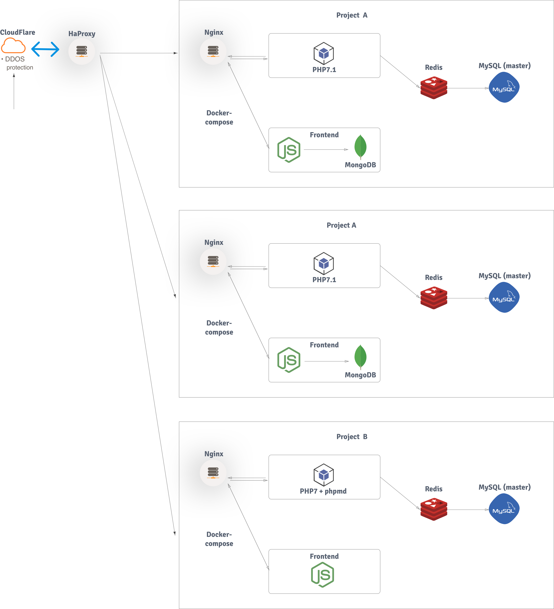

# Dockerized sytem for web development

A preconfigured docker environment with NGINX, HHVM, PHP7, PHP5.6 (both with imagick enabled php-md and other modules) and MySQL - More services to be added

## Services installation and configuration

As the architecture below explains, this system is based on microservices. Each microservice is indipendent. 

This containerized infrastructure is designed to have multiple projects, each having its own services.
To expose these projects, a new higher level network was added that will act as a load balancer and distribute the requests to the projects accordingly.

The steps to prepare a machine for docker are simple. You can install it anywhere be it a virtual machine in the cloud or a dedicated machine or your home computer. 

You can use this official script and install it on most OSes

```bash
$ wget -qO- https://get.docker.com/ | sh
```

All you need to install in your VM is wget.

***

Now, in order to be able to launch a project the **Load Balancer** and its network must be set up. 

The *network* directory contains the **docker-compose** file needed to create these services. The ideal setup will have in this directory, all the services to automate project routing and https. Such as using *docker gen* and *let's encrypt*. But the important thing is the network called loadbalancer0.

> Check out the feature branch `traefik` for a solution with [traefik](http://traefik.io) as a load balancer

***

And finally now you can set up your project. Open `docker-compose.yml` and `docker-compose.dev.yml` in the **yml** directory and configure it according to the project you're going to develop by removing or adding services. The `templates.yml` file contains snippets for other services. 

Once done configuring the services, run the following command to create the environment.

```bash
$ docker-compose -f yml/docker-compose.yml -f yml/docker-compose.dev.yml up -d --build --remove-orphans
```

If you're familiar with docker you'll understand what the command above does. For those who are not, it loads the first docker-compose *yml* and then extends it with the second one, it brings *up* the services as a *deamon* so the command exits once the services are up and *builds* each service instead of using the pre-existing images. The *remove orphans* flag, removes any containers that have failed to launch previously.

> Be careful that **remove orphans** can remove other projects' containers if **--project-name** is not specified before **up**


## File structure


## Proposed Architecture



## Files saved persistently

### configuration files:


